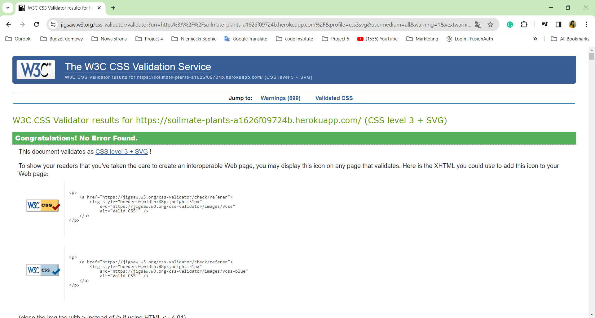
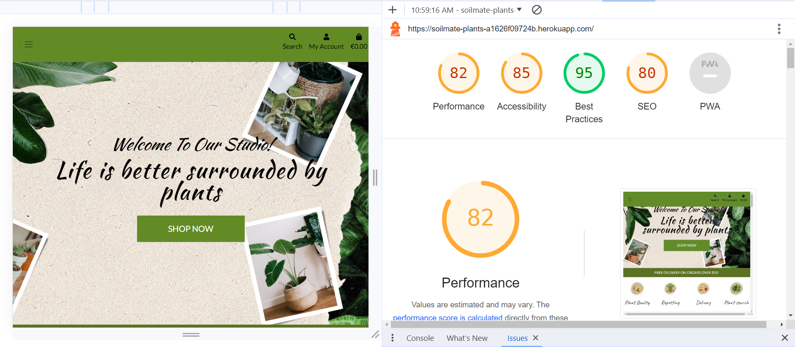
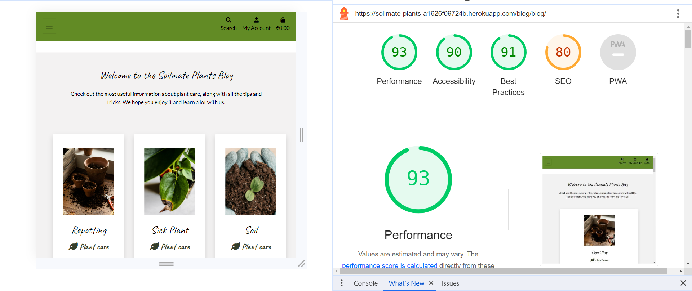

# Testing

Back to the [README](README.md)

## Testing User Stories

#### As a website user, I can

1. Navigate around the website and easily find the desired content.

- Navigating the website is easy and intuitive.

2. See a list of products and choose a desired product.

- On the "Our plants" page, the user can see all the plants and select a specific product.

3. Search products and be able to find a specific product.

- There is a search engine in the navbar, which makes finding a specific product much faster and easier.

4. Click on a product to find more details about it.

- After clicking on the selected product, the user will be taken to the product page where he can see more information about it.

5. Register for an account to be able to use the services offered to members.

- The user can register, thanks to which he has access to a wider range of services.

6. View product comments so that I can read other users' opinions.

- The user can see (if the product already has a comment) the comments of other users who have previously purchased a given flower.

7. Buy a product by using the website checkout system.

- The user can purchase the product using the website checkout system.

8. I can find more information about products on a website blog.

- The user can read posted posts about plants.

#### As a logged in website user, I can

1. Leave my review on the website about the purchased product.

- After logging in, the user can leave a comment about the purchased product.

2. Delete my previous reviews.

- The user can delete his comments.

3. Edit my previous reviews.

- The user can edit his comments.

4. Save my data under my personal profile.

- The user can save his personal data and purchase history on his profile on the website.

5. Update my profile details.

- The user can update his/her personal data on the profile.

6. Log out of the website.

- The user can log out at any time.

7. Buy a product using my personal profile, through the website checkout system.

- The user can make purchases after logging in in the secure checkout process and the purchase will be added to the shopping list and the user can see this list on their profile at any time.

#### As a website Superuser, I can

1. Create and publish a new product.

- As a website Superuser, I can add new products.

2. Create a draft of a new product so it can be finalized later.

- As a website Superuser, I can create a draft of a new product.

3. Create a new categories, edit products.

- As a website Superuser, I can add new categories and edit existing products.

4. Delete users, products, categories, and reviews.

- As a website Superuser, I can delete products, categories, comments/

5. Approve user's reviews.

- As a website Superuser, I can accept comments.

6. Change a user's permissions on the website.

- As website Superuser, I can change user's permissions on the website.

7. Create and upload new posts to be shown on the website.

- As a website Superuser, I can create new posts, edit them and delete them.

[Back to top](<#table-of-content>)

## Code Validation

The code on the Soilmate Plants site has been tested through W3C Markup Validation Service, CI Python JSHint.

### Markup Validation

The HTML validator detected several minor errors, most of which have been addressed and corrected.

This is the only message that appears on all pages:"Warning: The type attribute is unnecessary for JavaScript resources."

## Home Page
No error found
## Products page, product_detail page

On the "products.html" page, numerous errors were identified, including one specific issue highlighted by the validator. The error pertains to the presence of a space in the category name within a link's href attribute, resulting in an illegal character in the query.
For instance: a class="text-muted" href="/products/?category=Potted trees">

Despite this error, the URL functions correctly, and it was discussed with tutors. Due to the inherent nature of spaces in category names causing this issue, there is limited action that can be taken. The browser automatically converts %20 into a space, but this conversion does not manifest in the source code. As advised, a comment has been added to acknowledge this error.

## All blog page 
- No errors found 
## Contact page
- No errors found
## About page
- No errors found
## Reviews Page
- No errors found
## My profile
- No errors found
## Product management
- No errors found
## Shopping bag
- No errors found
## Design services
- No errors found

[Back to top](<#table-of-content>)

### CSS Validation

There were a few CSS errors that I managed to fix. I still have many warnings, but they do not affect the functionality of the website

 

[Back to top](<#table-of-content>)

### PEP Validation

CI Python Linter [Code Institute Linter](https://pep8ci.herokuapp.com/) was used to validate the Python code in the project. Following files have been validated:

**App Bag**
No major errors reported, some E501 line too long

- admin.py -  No errors reported
- apps.py -  No errors or warnings reported
- contexts.py -  No errors or warnings reported
- urls.py -  W292 no newline at end of file
- models.py -  No errors reported
- views.py -  1: E501 line too long (87 > 79 characters)
30: E501 line too long (138 > 79 characters)
33: E501 line too long (98 > 79 characters)
36: E501 line too long (94 > 79 characters)
40: E501 line too long (91 > 79 characters)
62: E501 line too long (134 > 79 characters)
67: E501 line too long (98 > 79 characters)
71: E501 line too long (91 > 79 characters)
94: E501 line too long (98 > 79 characters)
104: W292 no newline at end of file

**App Blog**
No major errors reported, some E501 line too long

- admin.py - 21: W292 no newline at end of file
- context.py-  No errors reported
- apps.py - No errors reported
- forms.py - No errors reported
- models.py - 42: W293 blank line contains whitespace
- urls.py - 9: W292 no newline at end of file
- views.py - 75: E501 line too long (80 > 79 characters)

**App Checkout**
No major errors reported, some E501 line too long

- **init**.py - No errors reported
- admin.py - 34: W293 blank line contains whitespace, 35: W391 blank line at end of file
- apps.py - No errors reported
- forms.py - 41: W293 blank line contains whitespace, 42: W391 blank line at end of file
- models.py - 81: E501 line too long (90 > 79 characters), 105: W293 blank line contains whitespace, 106: W391 blank line at end
  of file
- signals.py -
2: W293 blank line contains whitespace, : W391 blank line at end of file
- urls.py -
7: E501 line too long (93 > 79 characters)
8: E501 line too long (88 > 79 characters)
11: W293 blank line contains whitespace
12: W391 blank line at end of file
- views.py -
1: E501 line too long (87 > 79 characters)
77: E501 line too long (81 > 79 characters)
87: E501 line too long (88 > 79 characters)
95: E501 line too long (83 > 79 characters)
102: E501 line too long (80 > 79 characters)
114: E501 line too long (87 > 79 characters)
189: W391 blank line at end of file
- webhook_handler.py -
76: E501 line too long (80 > 79 characters)
77: E501 line too long (80 > 79 characters)
107: E501 line too long (107 > 79 characters)
137: E501 line too long (81 > 79 characters)
154: E501 line too long (93 > 79 characters)
163: W292 no newline at end of file
- webhooks.py -
**App Home**
- apps.py - No errors reported
- urls.py - No errors reported
- views.py - No errors reported

**App Products**
No major errors reported, some E501 line too long

- admin.py- All clear, no errors found
- apps.py- All clear, no errors found
- forms.py- 33: E501 line too long (102 > 79 characters)
- models.py - 103: W293 blank line contains whitespace
149: W391 blank line at end of file
- urls.py- 6: E501 line too long (84 > 79 characters)
9: E501 line too long (82 > 79 characters)
10: W292 no newline at end of file
- views.py-48: E501 line too long (80 > 79 characters)
50: E501 line too long (80 > 79 characters)
98: E501 line too long (94 > 79 characters)
125: E501 line too long (97 > 79 characters)
- tests.py- All clear, no errors found
- widgets.py-9: E501 line too long (87 > 79 characters)
9: W292 no newline at end of file

**App Profiles**
No major errors reported, some E501 line too long

- admin.py- All clear, no errors found
- apps.py-All clear, no errors found
- forms.py- 33: E501 line too long (98 > 79 characters)
34: W292 no newline at end of file
- models.py-15: E501 line too long (81 > 79 characters)
16: E501 line too long (84 > 79 characters)
17: E501 line too long (84 > 79 characters)
18: E501 line too long (81 > 79 characters)
21: E501 line too long (80 > 79 characters)
35: W292 no newline at end of file
- urls.py-6: E501 line too long (84 > 79 characters)
7: W292 no newline at end of file
- views.py-21: E501 line too long (86 > 79 characters)
50: W292 no newline at end of file

**Soilamate Plants**

- urls.py - All clear, no errors found
- views.py - All clear, no errors found
- wsgi.py - All clear, no errors found
- asgi.py - All clear, no errors found
- setting.py -93: E501 line too long (84 > 79 characters)
154: E501 line too long (91 > 79 characters)
157: E501 line too long (81 > 79 characters)
160: E501 line too long (82 > 79 characters)
163: E501 line too long (83 > 79 characters)
247: E501 line too long (94 > 79 characters)
248: E501 line too long (88 > 79 characters)

[Back to top](<#table-of-content>)

### JavaScript Validation

The [JSHint](https://jshint.com/) validator results can be seen below:

No errors were returned when passing through JSHint but the test with no errors.

- stripe_elements.js in checkout app
Metrics
There are 5 functions in this file.

Function with the largest signature take 1 arguments, while the median is 1.

Largest function has 10 statements in it, while the median is 5.

The most complex function has a cyclomatic complexity value of 3 while the median is 1.

Three warnings
27	'template literal syntax' is only available in ES6 (use 'esversion: 6').
91	'template literal syntax' is only available in ES6 (use 'esversion: 6').
110	Missing semicolon.

- inline jscript in bag.html in bag app
Nine warnings
1	Expected an identifier and instead saw '<'.
1	Expected an assignment or function call and instead saw an expression.
1	Missing semicolon.
1	Expected an assignment or function call and instead saw an expression.
1	Missing semicolon.
6	Missing semicolon.
13	'template literal syntax' is only available in ES6 (use 'esversion: 6').
21	Unclosed regular expression.
21	Unrecoverable syntax error. (100% scanned).
- inline jscript in products.html in products app
Seven warnings
1	Expected an identifier and instead saw '<'.
1	Expected an assignment or function call and instead saw an expression.
1	Missing semicolon.
1	Expected an assignment or function call and instead saw an expression.
1	Missing semicolon.
22	Unclosed regular expression.
22	Unrecoverable syntax error. (100% scanned).

[Back to top](<#table-of-content>)

## Additional Testing

### Manual Testing

The site was manually tested during the whole process of creation. All links and buttons work correctly.
All functions work as they should.No errors were detected by me.

## Home page

# Navigation

| **Test Scenario** | **Expected Result** | **Result** |
| ------------------ | ------------------- | ---------- |
| **Logo**                           | After pressing the logo, the user will always be redirected to the home page.                        | Working correctly |
| **Search Bar**                  | After entering the name of the plant you are looking for or a keyword (e.g., "Potted plants"), you will be taken to the page with the search results. If a given plant or search criterion is not found in the store, the following message will be displayed: "0 Products found for... (specific name)." | Working correctly |
| **My Account**    | After pressing My account, you will see two options to choose from in the window: Register or Login. If the user has an account, they can log in, and three new options will be shown: Product management, Profile, or Logout. All functions work properly. | Working correctly |
| **Shopping Bag**  | There is a shopping cart icon in the upper right corner. After clicking on it, you will be redirected to the SHOPPING BAG website. | Working correctly |
| **Home** | After pressing "home", a window will appear in which the user can select four options: Plants quality, Replanting, Delivery, Newsletter. | Working correctly |
| **Our Plants** | After pressing "Our Plants" the window will unfold, offering a user a variety of options in which the user can select "All plants" to see all available plants in the store, "By ranking" - will allow the user to sort plants based on rankings such as prices , alphabetical order, or customer ratings , the user can also select plants from a specific category. | Working correctly |
| **About us** | After pressing "About us" the window will unfold, offering a user such options as: "Company","Our Team","Gallery". | Working correctly |
| **Blog** | After pressing "Blog" the user will be redirected to the blog page. | Working correctly |
| **Contact us** | The user will be redirected to the "contact us" page where there is a contact form.| Working correctly |
| **More** |When you press "More", the window will unfold, offering a user a variety of options such as: "Customer reviews", "Design services", "Privacy policy" and only for the superuser "Newletter" . | Working correctly |
| **Button Shop Now**                    | Redirects the user to the "All Products" page.                    | Working correctly     |
| **Icons**                              |                                                |                       |
| - Repotting                            | Takes the user to the Repotting section.                         | Working correctly     |
| - Plants Quality                       | Takes the user to the Plants Quality section.                    | Working correctly     |
| - Delivery                             | Takes the user to the Delivery section.                          | Working correctly     |
| - Plants Search                        | Takes the user to the Product Page.                              | Working correctly     |
| - Icon Contact Us                      | Transfers the user to the Contact Us page.                       | Working correctly     |
| **Footer Section Social Media Links**  | Links for Facebook and Instagram work correctly.                  | Working correctly     |
| **Our Plants Page**                    |                                                |                       |
| - Buttons with Categories              | Potted Trees, Potted Plants, Hanging Plants, Exotic - Work correctly. | Working correctly |
| - Search Bar                           | Works correctly.                                                  | Working correctly     |
| - Product Image                        | After clicking, the user will be transferred to the "Product Detail Page". | Working correctly     |
| **Product Detail Page**                |                                                |                       |
| - Quantity Button                      | Allows adding or subtracting the quantity of the chosen product. | Working correctly     |
| - Add Review Button                    | Takes the user to a separate page where they can add a review, add an image, and submit. | Working correctly |
| - Edit Button                          | Takes the user to the edit page.                                   | Working correctly     |
| - Delete Button                        | Takes the user to a separate page to confirm the deletion of the review. | Working correctly |
| **Shopping Bag**                       |                                                |                       |
| - Keep Shopping Button                 | Takes the user to the "All Products" page.                        | Working correctly     |
| - Add to Bag                           | Adds the chosen product to the shopping bag.                      | Working correctly     |
| - Quantity Button                      | Allows adding or subtracting the quantity.                       | Working correctly     |
| **Blog Page**                          |                                                |                       |
| - Add Post Button                      | Takes the logged-in user to a separate page to write a post.     | Working correctly     |
| - Post Image                           | After clicking, the user will be transferred to the Post page.   | Working correctly     |
| - Back to Blog Page Button             | Returns the user to the Blog Page.                               | Working correctly     |
| - Edit Button                          | Takes the creator of the post to a separate page where the post can be edited. | Working correctly |
| - Delete Button                        | Takes the user to a separate page to confirm the deletion of the post. | Working correctly |
| **Review Page**                          |                                                |                       |
| - Edit Button      | The user who created the review will see an edit button.                   | Working correctly |
| - Delete Button   | The user who created the review will see a delete button.                | Working correctly |
| - Edit Button Functionality      | Clicking the edit button will take the user to the review edit page.      | Working correctly |
| - Delete Button Functionality   | Clicking the delete button will take the user to a confirmation page.     | Working correctly |
| - Review Deletion Confirmation   | On the confirmation page, the user needs to confirm the deletion of the review. | Working correctly |
[Back to top](<#table-of-content>)

### Lighthouse

Google Lighthouse in Chrome Developer Tools was used to test the site within the areas of *Performance*, *Accessibility*, *Best Practices* and *SEO*. I tested the *home page*, *view all blog posts page*, *view all products page*, *product management page* and *blog management page*. The testing showed the following:

- Home Page
 

- View Reviews Page
 

- View All Products Page
 

- Blog Page
 

